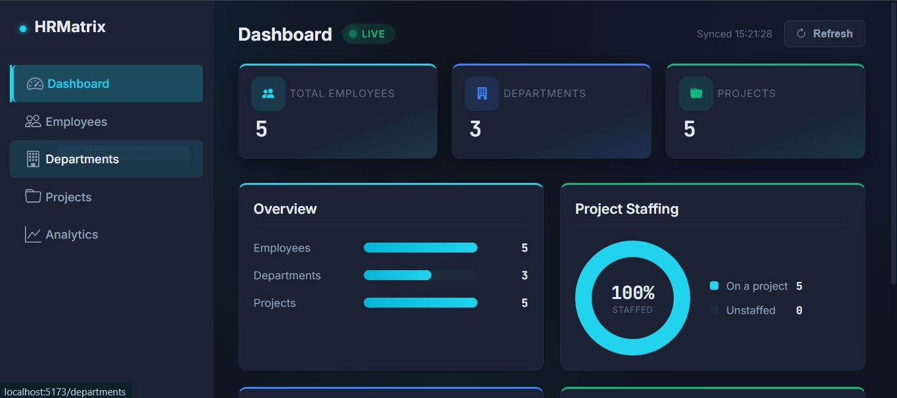
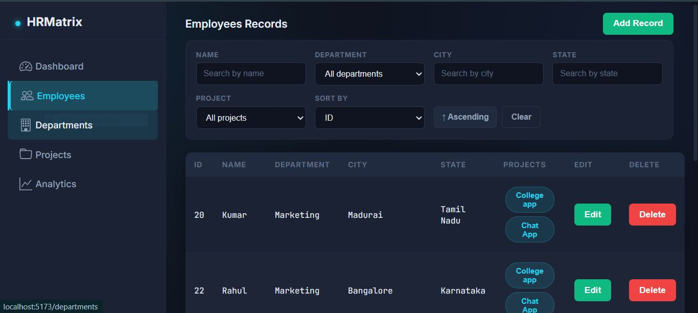
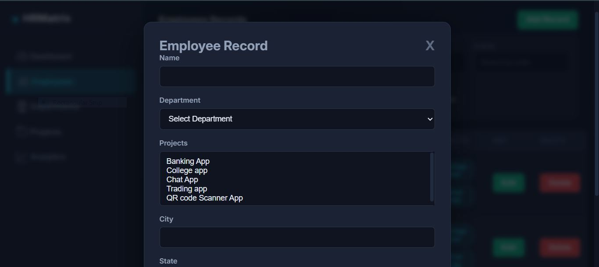
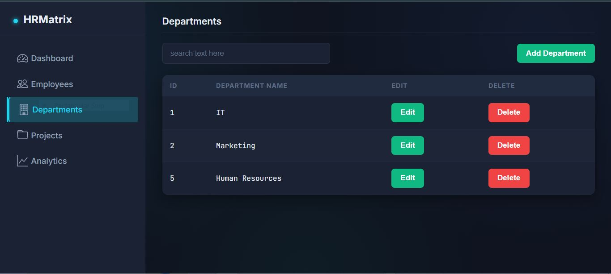
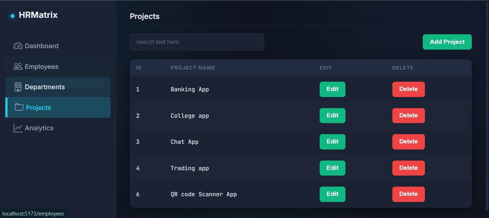
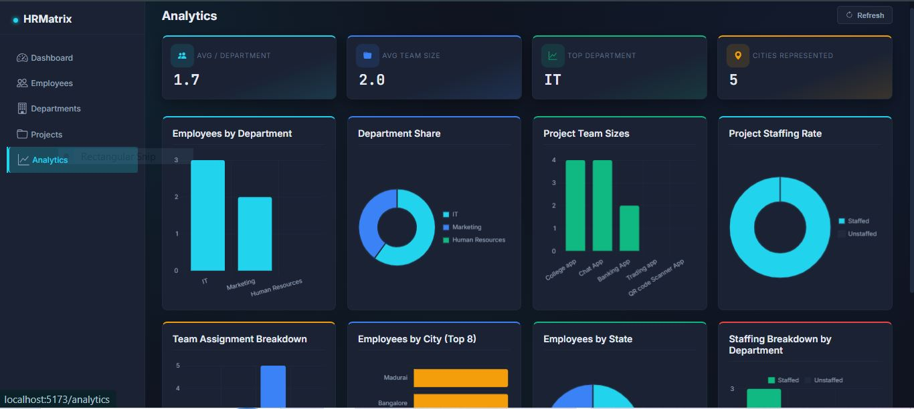

# 🧩 HRMatrix — HR Management Console

A full-stack Human Resource Management System built to handle real-world employee, department, and project data — with dynamic filtering, live analytics, and a relational data model backed by all four major JPA relationship types. Developed as a major project for the MCA program.

**Frontend:** this repository (React) ⚛️
**Backend:** [HR-Employee-Management-Pro](https://github.com/MuraliNexus/HR-Employee-Management-Pro) (Spring Boot + MySQL) 🍃

---

## 📖 Overview

Most academic HR-management demos stop at basic CRUD. HRMatrix goes further: it models real organizational relationships (an employee belongs to one department, works on many projects, has one address), supports dynamic multi-field search without hardcoding every filter combination, and turns the resulting data into live analytics instead of static tables.

The system is split into two independently deployable layers — a Spring Boot REST API handling persistence and business logic, and this React SPA consuming it — reflecting how HR software is actually built in industry rather than a monolithic student project.

## 🎯 Objectives

- 🔗 Design a normalized relational schema covering One-to-One, Many-to-One, and Many-to-Many relationships in a single domain (Employee ↔ Department, Employee ↔ Address, Employee ↔ Project).
- 🔍 Implement dynamic, multi-criteria search and sorting on the backend using JPA Specifications, rather than a fixed set of query methods.
- 🖥️ Build a responsive, componentized frontend that reflects live backend state — no hardcoded or mock data anywhere in the UI.
- 📊 Convert raw employee records into meaningful analytics (staffing rate, department load, project team sizes) computed client-side from real API responses.

## ✨ Key Features

**📊 Dashboard**
Live counts for employees, departments, and projects; a real-time staffing rate (percentage of employees assigned to at least one project); department distribution and project team-size breakdowns — all derived from the current dataset, not precomputed.

**👥 Employee Management**
Full CRUD with:
- 🔎 Multi-field dynamic filtering (name, department, city, state, project) resolved server-side via JPA Specifications and Hibernate joins
- ↕️ Server-side sorting on nested entity fields (e.g. sort employees by `department.deptName`)
- ⏱️ Debounced search input (350ms) to avoid firing a request per keystroke
- 📄 Pagination with configurable page size

**🏢 Department & 📁 Project Management**
Dedicated CRUD screens with instant client-side search.

**📈 Analytics**
Eight Chart.js visualizations — department share, staffing breakdown by department, project team sizes, city/state distribution, and team-assignment buckets — all computed on the fly from live employee data.

## 🖼️ Screenshots

**📊 Dashboard**


**👥 Employees**


**➕ Adding an Employee**


**🏢 Departments**


**📁 Projects**


**📈 Analytics**


## 🏗️ System Architecture

```
┌───────────────────────┐        REST / JSON        ┌──────────────────────────┐
│   React Frontend ⚛️     │ ─────────────────────────▶ │   Spring Boot Backend 🍃 │
│   (this repo)          │ ◀───────────────────────── │  HR-Employee-Mgmt-Pro    │
│  - Dashboard            │                             │  - REST Controller       │
│  - Employee/Dept/Proj   │                             │  - Service Layer         │
│  - Analytics (Chart.js) │                             │  - JPA Specifications    │
└───────────────────────┘                             │  - MySQL (JPA/Hibernate) │
                                                        └──────────────────────────┘
```

## 🛠️ Technology Stack

| Layer      | Technology                                  |
|------------|------------------------------------------------|
| 🎨 Frontend   | React 19, Vite, React Router v7               |
| 🌐 HTTP Client| Axios                                         |
| 📉 Charts     | Chart.js, react-chartjs-2                     |
| 🎭 Icons      | react-icons                                   |
| ⚙️ Backend    | Spring Boot 3, Spring Data JPA, Hibernate     |
| 🗄️ Database   | MySQL                                         |
| 🧠 Query Layer| JPA Specifications (dynamic Criteria API)      |

## 💡 Implementation Highlights

- **🧩 Dynamic filtering without query explosion.** Rather than writing a separate repository method for every filter combination, the backend builds predicates on the fly with `Specification<Employee>`, so any subset of name/department/city/state/project filters can be combined in one query.
- **🔗 Real relational modeling.** The `Employee` entity carries a `@ManyToOne` to `Department`, a `@OneToOne` (cascading) to `Address`, and a `@ManyToMany` to `Project` through a join table — covering the core JPA relationship types in one cohesive schema instead of isolated examples.
- **📊 No fabricated frontend data.** Every chart and stat on the Dashboard and Analytics pages is derived with `useMemo` from the actual employees/departments/projects fetched from the API — department distribution, staffing percentage, and team sizes are computed, not hardcoded.
- **🛡️ Resilient UX.** Every data-fetching screen has explicit loading, empty, and error states (e.g. "Couldn't reach the backend — check that the Spring Boot server is running"), so the app degrades gracefully instead of showing blank screens when the backend is offline.

## 🚀 Getting Started

### ✅ Prerequisites

- Node.js 18+
- The [backend](https://github.com/MuraliNexus/HR-Employee-Management-Pro) running locally on `http://localhost:8080` with MySQL configured

### 📦 Install & Run

```bash
git clone https://github.com/MuraliNexus/HRMatrix.git
cd HRMatrix
npm install
npm run dev
```

The app runs at `http://localhost:5173` and expects the backend at `http://localhost:8080/App`.

### 🏗️ Build

```bash
npm run build
```

## 📂 Project Structure

```
src/
├── Components/
│   ├── Dashboard.jsx     # 📊 Overview cards + live charts
│   ├── Employee.jsx      # 👥 CRUD, dynamic filter/sort/pagination
│   ├── Department.jsx    # 🏢 Department CRUD
│   ├── Project.jsx       # 📁 Project CRUD
│   ├── Analytics.jsx     # 📈 Chart.js analytics dashboards
│   └── Sidebar.jsx       # 🧭 Navigation
├── App.jsx               # 🛣️ Route definitions
└── Super.css              # 🎨 App-wide styling
```

## 🗺️ Routes

| Path            | Page        |
|------------------|-------------|
| `/`              | 📊 Dashboard   |
| `/employees`     | 👥 Employees   |
| `/departments`   | 🏢 Departments |
| `/projects`      | 📁 Projects    |
| `/analytics`     | 📈 Analytics   |

## 🔮 Future Enhancements

- 🔐 JWT-based authentication and role-based access (Admin / HR / Employee views)
- 🔢 Server-side total count for exact pagination boundaries
- ⚙️ Centralized API config (`.env`) instead of hardcoded `BASE_URL` per component
- 📤 Export to CSV/Excel from the Employees table

## 👨‍💻 Author

**Murali** — MCA, SRM Institute of Science and Technology (SRM KTR)

---

*Built to demonstrate full-stack development competency: relational data modeling, dynamic query construction, REST API design, and a production-style React frontend.* 🚀
